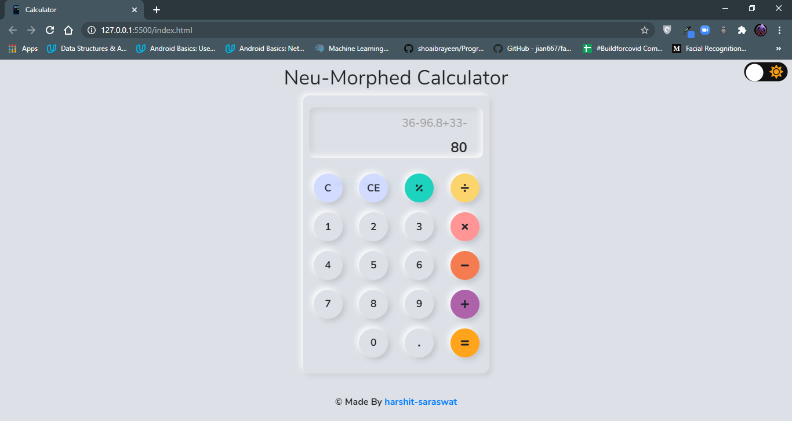
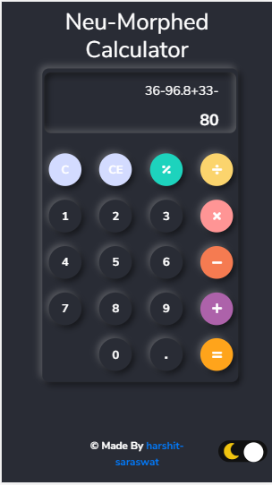

# Neumorphism-Calculator
This is a small personal project to implement Neumorphism Styling Concept on a simple calculator app.
This webapp is a self project made to implement Neumorphism Design with Light/Dark Mode Switching and Device Responsive Behaviours.
The project uses HTML 5, CSS 3, JS ES6, BootStrap 4.5, JQuery for development.

## Snapshots:
### Light Mode-

### Dark Mode-

## Inspiration:
The inspiration from the website has been taken from many design templates and tutorials from YouTube, Dribble, etc.

## Acknowledgements:
I'd like to express my greatest gratitude towards [FlorinPop17](https://codepen.io/FlorinPop17/pen/XWWZYYG?__cf_chl_jschl_tk__=a45fc338078d31afa60c8cb328a3a4882717472c-1596985075-0-AcPhE_3UbA4LfMUl8-RlvVbebAdQaP5GhJ2Eb0oKmSF-fu8YV6QV5HFQpt0ML5sqrF5BmMaB3RQ4K-SawZ4geKbxTAnc3MCydUI0CNzGNgb5Bcbg7tsNikDh1GFzkXIB-VX1VFUSGnbuztp_Tuzec0j4xRoTmdU3wpKKcxdGn7m8hUYqHYxaUbQEfzUiEoKJx8HvBpJweTZVOQuxvxYg9InLgkdh6y4Z9ARZNQqVB4wZGacvrqco4HVvdofShsw4uSVToFfFk5Z2yRlE9vE_ti98dIvS2KglY3__0t58wR2WQA6iPCLS1-qGz5CnqnE1zpEsgd5RngtXfY8YVEPRDYBFd65pYFHHhWc2GC1sligp) for this amazing codepen to implement theme-switching.
For the website I've used the following resources:
* ***Icons***: [FlatIcons](https://www.flaticon.com/)
* ***Fonts***: [GoogleFonts](https://fonts.google.com/)
* ***Bootstrap***: [Bootstrap](https://getbootstrap.com/)